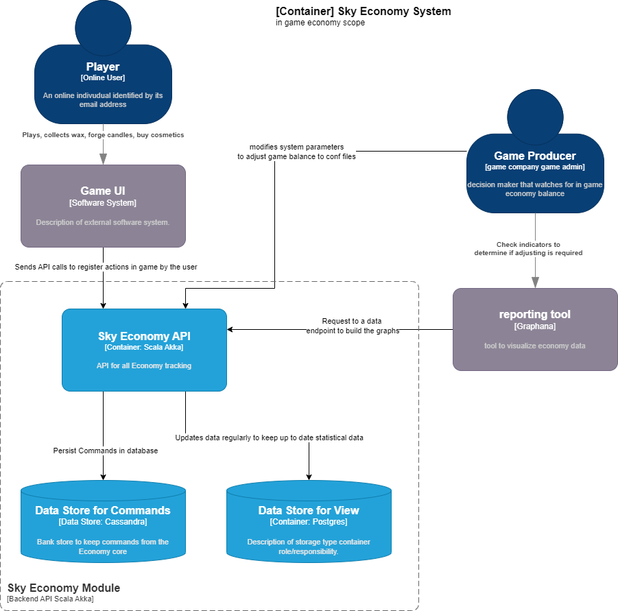

# sky-economy-module

## Premise
a game company published a Demo of a map for a beta about an open world with an MMO strategy
The beta was a success and after releasing an open demo it went viral and it was a complete hit. The company then decides to publish it and for this they need a monetizing model to create profit and have devised an game economics system where players can travel the world collecting a single resource called 'Wax' that after collecting an parametrizable amount the player will be able to forge "white candles". This white candles will allow the player to buy Non-investment products(emotes and cosmetics) from NPCs in the game and make progress in the ultimate goal of unlocking all the cosmetics in the game. There's also a secondary currency in game called 'hearts' that are a social currency when a player exchange with a friend once every day.

The profit for t BN he company will be in creating a micro transaction store where the player can buy bundles of white candles with real life money.

## Flow

The Basic flow for all the interaction is the Following :

###  Write Model Flows
White candle flow (Hard Currency)

Player collects wax orbs -> for each (wax_per_candle_setting) wax orbs they can Forge a candle -> candles are collected in each players bag -> candles are spent with merchant spirits for items to the inventory.  

### Read Model Flow (Statistics)

System provides an endpoint for statistic analysis with up to date metrics about
* Online players
* Resources Collected
* Currency in circulation
* Currency spent 

## Metrics

System performance indicators
* Mailbox size
* Mailbox time
* Sent message

## Diagrams

### Context Diagram

### Container Diagram

### Component Diagram

